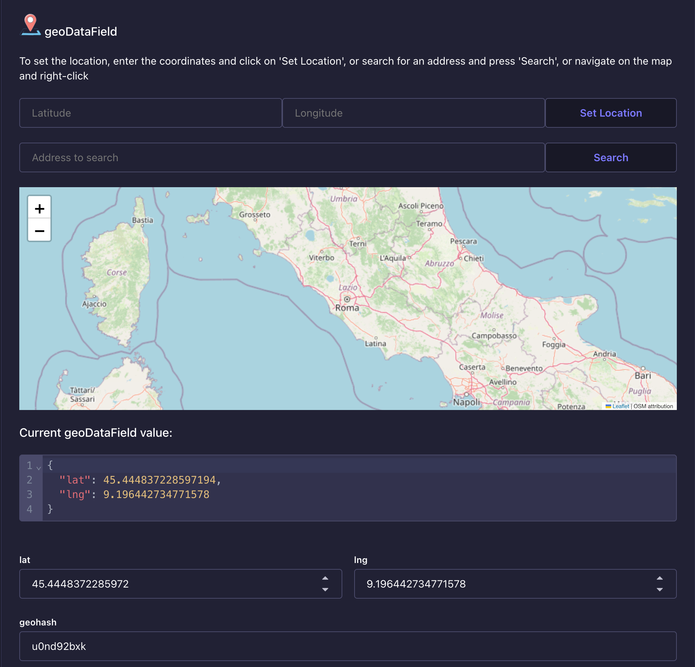

 
# Strapi GeoData

Strapi GeoData is a plugin that enhances Strapi's functionality by adding latitude, longitude, geohash, and a convenient map.

# ❗ Requirements
Strapi v5

## How It Works

The operation is simple: by adding the custom field to a collection, a map and two control fields will be created.

To add a marker, you can either enter the latitude and longitude directly and then click "Set Location", search for an address and click "Search", or move around the map and right-click to place a marker.



The JSON field is not editable; it simply displays the values that will be saved.

The values stored in the JSON field are not very useful for filtering results, but you can create three fields: `lat`, `lng`, and `geohash`. When saving an item, these three fields will be automatically populated and can then be used for queries.

**Important:** The fields must be structured as follows:

```json
{ "lat": float, "lng": float, "geohash": string }
```

If you want to update or create an item in the collection and set the location, do not modify the three fields lat, lng, and geohash (if created) directly. Always write the geohash field in the format:

```json
{ "lat": float, "lng": float }
```

The values will then be automatically written to the three fields.

🚀 Strapi Configuration (Required)
To allow all Maps assets to load correctly, customize the strapi::security middleware inside ./config/middlewares.js.

```javascript
export default [
  // ...
 {
    name: 'strapi::security',
    config: {
      contentSecurityPolicy: {
        useDefaults: true,
        directives: {
          "connect-src": ["'self'", "https:"],
          "script-src": [
            "'self'",
            "unsafe-inline",
            "https://*.basemaps.cartocdn.com",
          ],
          "media-src": [
            "'self'",
            "blob:",
            "data:",
            "https://*.basemaps.cartocdn.com",
            "https://tile.openstreetmap.org",
            "https://*.tile.openstreetmap.org",
          ],
          "img-src": [
            "'self'",
            "blob:",
            "data:",
            "https://*.basemaps.cartocdn.com",
            "market-assets.strapi.io",
            "https://*.tile.openstreetmap.org",
          ],
        },
      },
    },
  },  
  // ...
];
```
(Thanks to the developers at strapi-leaflet-geoman for the tip!)

# Install Now
To install the plugin, run the following commands:

```bash
npm install strapi-geodata
```

```bash
yarn add strapi-geodata
```

